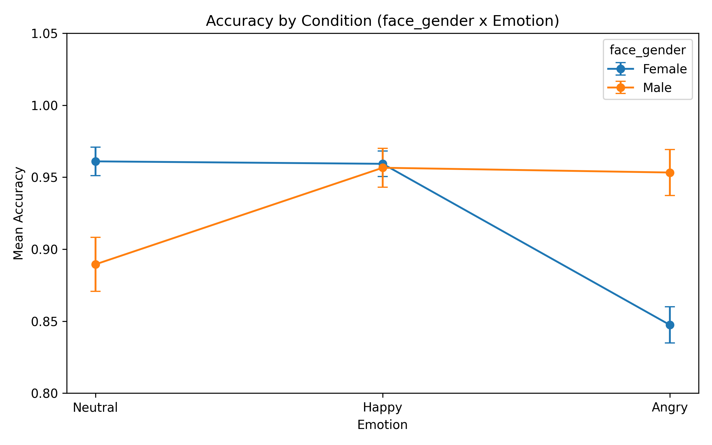

# Data Cleaning and Statistical Analysis of a Face-Gender-Emotion Experiment

<details>
<summary>🇹🇷 Türkçe özet için tıklayın</summary>

Team Axion adlı takımla yürütülen bir davranışsal deneyin veri temizleme ve istatistiksel analiz kısmı. Takım deneyi tasarlayıp veriyi topladı; ham PsychoPy çıktısından nihai hipotez testlerine kadar **veri temizleme pipeline'ı ve tüm istatistiksel analiz bireysel katkım** (proje raporlarının resmi imza sayfasında "Data Analysis: Yusuf Oğuz" olarak geçiyor).

**Veri temizleme:** 20 ham katılımcı dosyasından 2'si dışlandı (1 pilot/test koşusu, 1 katılımcı yaş kriterinin altında) → N=18. Deneme (trial) seviyesinde iki aşamalı temizlik: global RT kırpma (0.2-3.0 saniye dışı, 61 deneme/%2.82 çıkarıldı) ve katılımcı-içi z-skor aykırı değer temizliği (|z|>2.5, 72 deneme/%3.43 daha çıkarıldı), toplam %6.16'lık bir temizlik oranı, tamamen dokümante edilmiş kriterlerle.

**Analiz:** 2×3 Repeated-Measures ANOVA (yüz cinsiyeti × duygu), Greenhouse-Geisser düzeltmesi, Holm-düzeltmeli post-hoc testler. **Asıl bulgu:** tepki süresinde anlamlı bir etki yok, ama doğrulukta hem duygunun ana etkisi (p≈0.00004) hem de yüz cinsiyeti × duygu etkileşimi çok güçlü anlamlı (p≈0.00000009). Bu etkileşimin yönü yüz cinsiyetine göre tersine dönüyor: kadın yüzlerinde "kızgın" ifade doğruluğu düşürürken, erkek yüzlerinde "nötr" ifade düşürüyor.

**Deney bağlamı (kısaca):** KDEF veri setinden, saç/kulak ipuçları kaldırılmış yüz fotoğrafları; katılımcı ifadeyi görmezden gelip yüzün cinsiyetini olabildiğince hızlı/doğru belirtiyor. 2×3 tasarım, katılımcı başına 120 deneme.

**Gizlilik notu:** bu depo anonimleştirilmiş bir kopya. Katılımcı isimleri P01-P20 koduna çevrildi, KDEF uyaran görselleri kendi lisansı nedeniyle depoda yok.

</details>

---

A team behavioral-psychology project (Team Axion), where my individual contribution was the data cleaning pipeline and the full statistical analysis, from the raw per-participant PsychoPy exports through to the final hypothesis tests. The project's own report signatures record this split: the team designed the study and collected the data, while data analysis (Report 4) is credited to me alone.

## Data cleaning pipeline

- **Sample:** 20 raw participant files collected, 2 excluded before analysis (one pilot/test run, one participant below the minimum age criterion), leaving **N = 18** (10 female, 8 male).
- **Trial-level cleaning**, applied in two stages on the merged trial dataset:
  1. Global RT trimming (0.2-3.0 seconds): removed 61 trials (2.82%), leaving 2,099.
  2. Within-subject outlier removal (z-score within each participant x face-gender x emotion cell, \|z\| > 2.5): removed 72 more trials (3.43%), leaving 2,027.
  3. Combined, 6.16% of all trials were excluded, on documented, pre-specified criteria.
- **Aggregation:** trial-level data was collapsed into one row per participant x face-gender x emotion cell (2 x 3 = 6 cells), producing a 108-row (18 x 6) subject-level summary table used for every statistical test.
- **A design decision worth noting:** handedness was recorded (16 right-handed, 2 left-handed) but deliberately excluded as an analysis factor, since that split was too imbalanced to test meaningfully.

## Statistical analysis and results

A 2 (face gender: female/male) x 3 (emotion: angry/neutral/happy) repeated-measures ANOVA was run separately for reaction time and accuracy, with Greenhouse-Geisser correction for the emotion and interaction effects, and Holm-corrected post-hoc pairwise tests wherever the omnibus effect was significant.

**Reaction time:** no significant effects. Face gender was borderline (F(1,17) = 4.437, p = 0.0503), emotion and the interaction were not significant. Descriptively, responses were somewhat slower for female-face stimuli, but the pattern didn't clear the significance threshold.

**Accuracy:** this is where the real effect shows up.
- Main effect of emotion: F(2,34) = 15.953, p = 3.9 x 10⁻⁵ (significant).
- Face gender x emotion interaction: F(2,34) = 29.213, p = 9.0 x 10⁻⁸ (strongly significant).

Holm-corrected post-hoc comparisons showed the interaction isn't just "some emotion is harder": which emotion hurts accuracy flips depending on the face's gender.
- **Female faces:** angry expressions were significantly less accurate than both neutral (p = 1.4 x 10⁻⁵) and happy (p = 1.1 x 10⁻⁷); neutral and happy didn't differ.
- **Male faces:** neutral expressions were significantly less accurate than both angry (p = 0.0013) and happy (p = 0.0011); angry and happy didn't differ.



The crossing lines are the interaction: female-face accuracy stays high through neutral and happy and drops sharply at angry, while male-face accuracy is lowest at neutral and recovers for angry and happy, the opposite pattern.

**What this means:** the classic face-processing claim that identity judgments (here, gender) and expression processing are functionally independent held up for reaction time, but not for accuracy. Response speed wasn't reliably affected by emotion, yet which expression degrades gender-categorization accuracy depends on the face's own gender, a real, statistically robust dissociation between speed and accuracy in this task.

Full RM-ANOVA tables and post-hoc output: `codes/results/main_analysis/`. Full writeup: `reports/report4_final_analysis.pdf`.

## Experiment context

- **Stimuli:** faces from the KDEF (Karolinska Directed Emotional Faces) dataset, cropped to isolate the inner facial features and remove hair and ear cues.
- **Task:** the participant ignores the expressed emotion and reports the face's gender as fast and accurately as possible (F for female, M for male).
- **Design:** 2 (face gender) x 3 (emotion), 120 trials per participant, the same pseudo-random trial order for every participant via a fixed seed.
- **Tool:** PsychoPy (`experiment/gender_task.psyexp`).

## Folder structure

```
face-gender-emotion-categorization/
├── experiment/               PsychoPy experiment definition and runner (gender_task.psyexp, gender_task_lastrun.py, conditions.xlsx)
├── codes/
│   ├── data_preparation.ipynb
│   ├── data_preproccessing.ipynb
│   ├── RM_anova.ipynb
│   ├── extra_analysis.ipynb
│   ├── raw_data/              Anonymized participant data (P01-P20)
│   ├── processed_data/        Merged and cleaned data, plus plots
│   └── results/main_analysis/  ANOVA tables, post-hoc tests, summary statistics
└── reports/                   The project's four written reports
```

## A note on data privacy

This repository is an anonymized copy of the original raw dataset. Participant names, both in file names and inside the CSVs, were replaced with participant codes (P01-P20). Team members' authorship information (on the reports' signature pages) was left untouched, since that's academic attribution rather than personal data. The KDEF stimulus images themselves aren't included here, because of their own license terms.

## Tools

Python: Pandas for the cleaning and aggregation pipeline, Pingouin and statsmodels for the RM-ANOVA and post-hoc tests, NumPy and SciPy for the underlying computations, Matplotlib and Seaborn for the diagnostic plots. PsychoPy for the original data collection.
